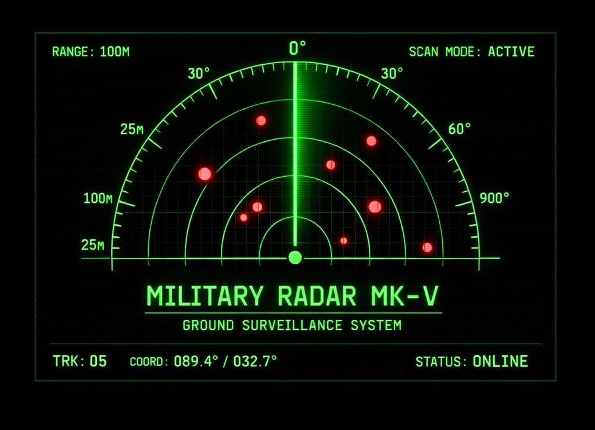

# 🎯 Military Ground Radar System — MK-V



> Real-time radar visualization built with Processing + Arduino + HC-SR04 Ultrasonic Sensor

---

## 📸 Overview

A military-style radar display that reads live data from an Arduino-controlled servo sweeping an ultrasonic sensor from 0° to 180° and back. Detected objects appear as red dots on the radar screen — completely independent of the sweep line.

---

## 🛠️ Hardware Required

| Component | Details |
|---|---|
| Arduino Uno | Any Uno-compatible board |
| SG90 Servo Motor | 180° rotation |
| HC-SR04 Ultrasonic Sensor | Range: 2cm – 400cm |
| Jumper Wires | Male-to-male |
| USB Cable | Arduino to PC |

### Wiring

```
HC-SR04         Arduino
--------        -------
VCC     →       5V
GND     →       GND
TRIG    →       Pin 10
ECHO    →       Pin 11

SG90 Servo      Arduino
----------      -------
Red (VCC)  →    5V
Brown (GND)→    GND
Orange     →    Pin 9
```

---

## 💻 Software Required

| Software | Version | Download |
|---|---|---|
| Arduino IDE | 2.x+ | arduino.cc |
| Processing | 4.x+ | processing.org |
| Processing Sound Library | Latest | via Processing Library Manager |

---

## 🔌 Arduino Code

Upload this sketch to your Arduino before running Processing:

```cpp
#include <Servo.h>

Servo myServo;

const int trigPin = 10;
const int echoPin = 11;

int angle     = 0;
int direction = 1;

void setup() {
  Serial.begin(9600);
  myServo.attach(9);
  pinMode(trigPin, OUTPUT);
  pinMode(echoPin, INPUT);
}

void loop() {
  myServo.write(angle);
  delay(30);

  float distance = getDistance();

  // Send: angle,distance
  Serial.print(angle);
  Serial.print(",");
  Serial.println(distance);

  angle += direction;
  if (angle >= 180) direction = -1;
  if (angle <= 0)   direction =  1;
}

float getDistance() {
  digitalWrite(trigPin, LOW);
  delayMicroseconds(2);
  digitalWrite(trigPin, HIGH);
  delayMicroseconds(10);
  digitalWrite(trigPin, LOW);

  long duration = pulseIn(echoPin, HIGH, 30000);
  float distance = duration * 0.034 / 2.0;

  if (distance <= 0 || distance > 400) return 0;
  return distance;
}
```

---

## ▶️ How to Run

1. Wire the hardware as shown above
2. Upload the Arduino sketch
3. Open `MilitaryRadar_v5.pde` in Processing
4. Check the serial port — Processing auto-selects `ports[0]`
5. If your Arduino is on a different port, change this line:

```java
myPort = new Serial(this, Serial.list()[0], 9600);
//                                        ↑
//                          change index if needed (0, 1, 2...)
```

6. Press **Run** in Processing

---

## 🖥️ Interface

```
┌─────────────────────────────────────────────────────┐
│ [HUD Panel]    [THREAT BAR]         [DOT LOG]        │
│                                                      │
│         ·  ·  RADAR SCREEN  ·  ·                    │
│                                                      │
│       sweep line rotates 0°→180°→0°                 │
│       red dots = detected objects                    │
│                                                      │
│ [MINI-MAP]    [PROXIMITY BAR]    [COMPASS]           │
└─────────────────────────────────────────────────────┘
```

### HUD Elements

| Element | Description |
|---|---|
| Sweep Line | Green rotating line — shows current servo angle |
| Red Dots | Detected objects — fixed at detection position |
| Threat Bar | Overall threat level: LOW / MED / HIGH / CRIT |
| Proximity Bar | How close the nearest object is |
| Mini-Map | Small overview of all dots |
| Compass Rose | Current sweep direction |
| Dot Log | Table of all active detected targets |

---

## ⌨️ Keyboard Controls

| Key | Action |
|---|---|
| `R` | Start / Stop recording to `radar_rec.csv` |
| `P` | Start / Stop playback from `radar_rec.csv` |
| `C` | Clear all detected dots |
| `+` | Increase playback speed |
| `-` | Decrease playback speed |

---

## ⚙️ Configuration

All tunable parameters are at the top of `MilitaryRadar_v5.pde`:

```java
float R       = 310;   // Radar display radius in pixels
float maxDist = 40.0;  // Max detection range in cm

int   DOT_LIFE  = 500; // Frames before a dot fades (60fps = ~8 sec)
float MATCH_A   = 8.0; // Angle tolerance to match existing dot (degrees)
float MATCH_D   = 4.0; // Distance tolerance to match existing dot (cm)
int   TRAIL     = 120; // Sweep trail length in frames
```

---

## 🔴 How Red Dots Work

The sweep line and red dots are **completely independent**:

```
Arduino sends:  angle, distance
                   ↓              ↓
           smoothAngle        registerDot()
           (sweep only)       (stores dot)
               ↓                   ↓
         drawSweepTrail()    drawRedDots()
         (sweep line)        (red dots)
              ↕                    ↕
         No relation          No relation
         to dots              to sweep
```

- A dot is created when `distance >= 1cm AND distance < maxDist`
- The dot stays at its **exact detection position** forever
- If the sweep passes over the same spot again → dot age resets
- If not re-detected for `DOT_LIFE` frames → dot fades out

---

## 🔊 Sound

A bell sound plays from the laptop speaker each time a **new** dot is detected. There is an 80-frame cooldown between bells to avoid rapid firing.

---

## 📁 Files

```
MilitaryRadar_v5.pde    — Main Processing sketch
README.md               — This file
radar_rec.csv           — Created automatically when recording
```

---

## 🚀 Possible Upgrades

- **ADS-B receiver** — track real aircraft overhead using RTL-SDR dongle
- **2D servo mount** — add elevation axis for 3D scanning
- **WiFi module (ESP8266)** — wireless data transmission
- **OLED display** — show distance directly on hardware
- **Multiple sensors** — wider coverage area

---

## 📜 License

Free to use for educational and personal projects.

---

*Built with Processing 4 + Arduino Uno + HC-SR04*